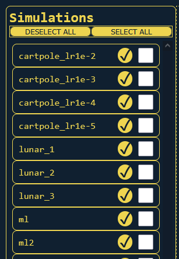
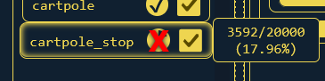
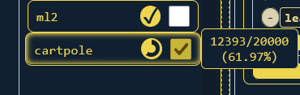
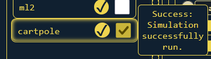
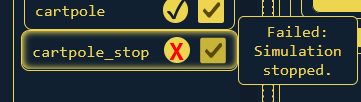
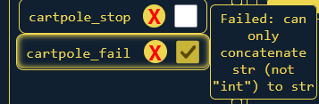

# Sidebar
The Simulation Sidebar on the left of the screen provides an overview of the
project's Simulations and provides some interactivity.\
.

Each running or completed simulation is shown on the sidebar in a selection box. Boxes display the simulation name, a progress/status indicator, and a selection checkbox. Select any number of simulations by right-clicking and dragging over a set of simulation boxes. Hovering over a simulation box will also show the current progress or status of that simulation. The displayed status is the latest status known for the simulation.

## Cancelling
Click on progress bar to attempt to cancel:\

## Hovering
Hover for progress updates:\

Completed simulations will show their status:\
\
\

[Next: "Control" Tab](02-control.md)