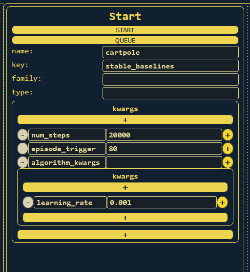

# Control
The Control tab provides an interface to the functions of project Simulations.
The gist of all control methods is that they send specific API calls with
keyword-argument dictionaries to the backend, which can then be unpacked by the
relevant simulation and used to start, stop, schedule, and provide input to the selected simulations.

## Start Panel
Use the Start panel to create new simulations. The name is the display name,
the key is the identifier for the type of simulation, and nested kwarg
dictionaries can be specified below:\

## Control Requests
Simulations can also send control requests to the frontend. These show up in the
Control panel and can be clicked to show detailed text at the bottom. Certain
simulations might be "interactive" in the sense that they need user input.
This can be achieved by supplying kwargs in the control panel and sending them
to selected simulations. Note that ALL simulations selected in the sidebar will
have the control response sent to them:\

[Next: "Analyze" Tab](03-analyze.md)