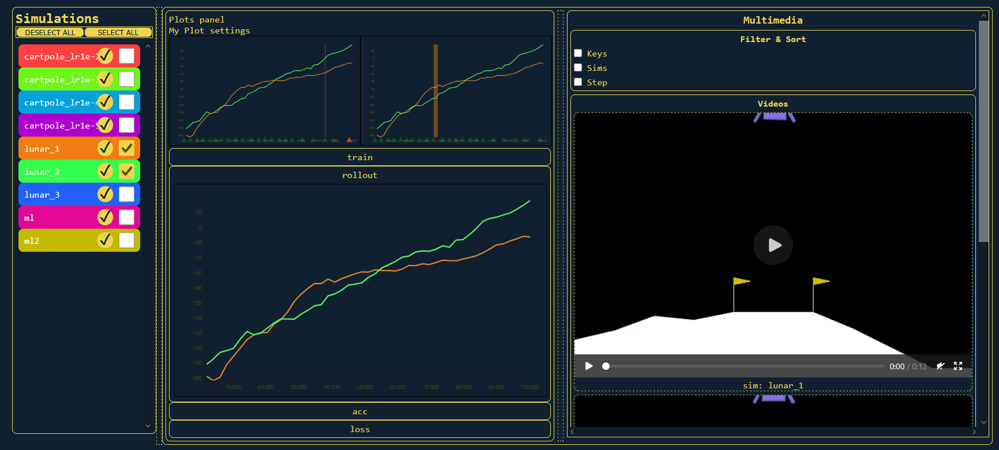
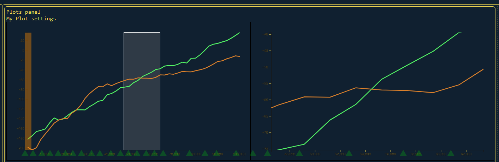
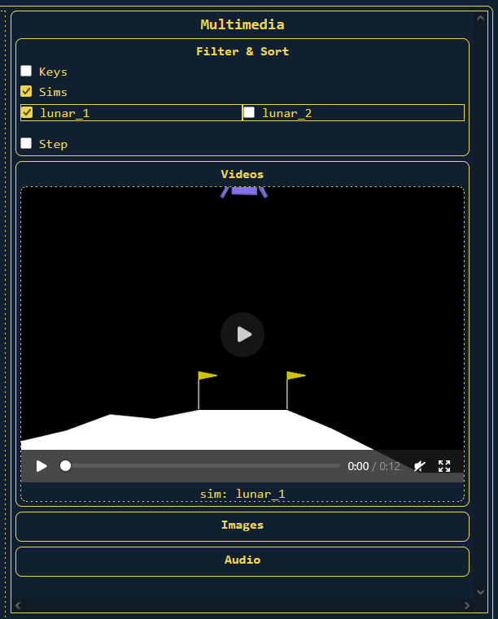

# Analyze
The Analyze tab shows data collected by each simulation. This includes basic line
plots for scalar data, but also a multimedia panel for media like videos, images,
and audio.

## Overview
The Analyze tab has 2 main features - the scalar plotting panel, and the multimedia panel.\

### Scalar Plot Panel
The middle panel is reserved for scalar line plots.
#### **Overview & Details Plot**
The top left plot is the main overview plot while the top right is the details plot. These plots are the same as other line plots with a few additional features. First, you can click-and-drag on the overview to "brush" a region of time. This updates the details plot to contain only the selected region for more detailed inspection. Additionally, these are the only plots that display multimedia indicators (MMIs). If any media is associated with the selected simulations, MMIs can be seen at the bottom of both the overview and details plots.
#### **Other Plots**
All other plots are organized by their logged "key". These keys should use a directory-style naming convention, with each subcategory being split by `/`, e.g. `loss/training` could log the training loss for a model. The plots are then separated into groups according to their base category, e.g. `loss`, with each plot in the category being for a different key. These categories can be minimized or expanded to see all the associated plots. All lines plots can be hovered to display a tooltip showing the step, value, and associated simulation at that point.

### MultiMedia Indicators (MMIs)
MMIs can be hovered to show the region of the plot for which there exists media that can be shown in the multimedia panel. Because many different media points can be condensed into a single MMI, you can also click on the highlighted region to zoom in. Clicking on an MMI causes all media in it to show up in the multimedia panel.

### Multimedia Panel
The panel is separated into various types of media like video, images, and audio. Each section can be minimized or maximized by clicking on the title. At the top is also a panel for filtering media results. Currently you may filter by key, simulation, or for a timestep range.\

<!-- TODO: Text media. -->

## Settings
Access the settings bar that floats under the header bar.
#### **Smooth Spread:**
If above 0, attempts to smooth scalar plots. Smoothed lines will show on top of the original data, which will be translucent. This works by averaging each point with a percentage of surrounding points. Plots with more datapoints will have better smoothing results.
#### **Smooth Factor:**
The number of times the smoothing loop runs to average nearby points.
#### **Rescale Details Y-Axis:**
When checked, the y-axis of the details plot will automatically rescale so that the data in the region takes up the available vertical space. When not checked, the y-axis scale remains the same.

[Next: "Configs" Tab](04-configs.md)