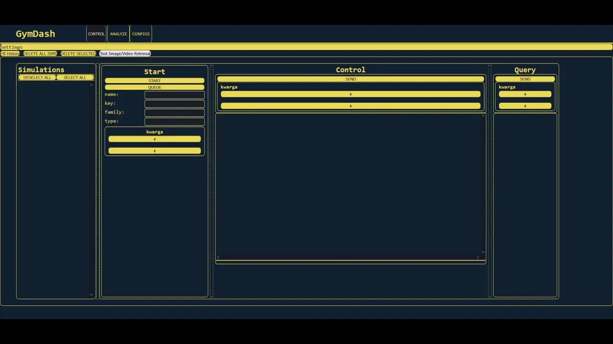

# Examples
## Your First Simulation
Here we run a simulation utilizing Gymnasium's [CartPole-v1](https://gymnasium.farama.org/environments/classic_control/cart_pole/) environment and train it
with [PPO](https://stable-baselines3.readthedocs.io/en/master/modules/ppo.html) from stable baselines. After only ~8000 steps, the agent has learned to somewhat control the cart.

- Navigate to the "Control" tab by clicking the button on the header.
- Find the "Start" panel.
- In the "name" field type `my simulation`.
- In the "key" field type `stable_baselines`. This represents they type of simulation to be launched. The defaults for this type use the CartPole environment with a PPO policy.
- Click a "+" key under the "kwargs" section. Add a new kwarg with key (left box)
of `num_steps` and a value (right box) of `20000`. Add another kwarg with key-value pair of key=`episode_trigger` value=`80`. The first kwarg increases the default
time from 5000 to 20000 steps, and the second kwarg records a video every 80 episodes.
- Click the "Start" button. A new simulation selection should appear in the sidebar.
Hover over the selection to see the progress bar periodically update.
- If all goes well, the simulation should complete, and the status indicator should
show a checkmark, otherwise, it will show a red "X".
- Navigate to the "Analyze" tab by clicking the header button.
- Select the `my simulation` selection (if not selected already), and refresh the
plots. You should see a plot or plots providing scalar information over the
lifetime of the simulation. Hopefully, you see the reward value increase over
time!

## Interactive
Here we use a "custom_control" Simulation which runs for some set amount of time, stopping and waiting for user input at user-denoted time points.

- Fill in name=`control sim` and key=`custom_control`.
- Add a kwarg with key=`interactive` and any or no value.
- Start the simulation.
- You should see a control request show up in the Control panel. Click it to show the details.
- In the Control panel, fill in with kwargs:
    - name=`continue`, value=any
    - name=`total_runtime`, value=`5`. The sim will run for 5 seconds.
    - name=`pause_points`, value=`[2]`. The sim will stop after 2 seconds and request a `continue` flag from a later control response.
- Send the control response and clear the old request.
- After a couple seconds, a second control response should show up. You may resend the prior response because it contains the `continue` key. The simulation should them complete.

## ML Model
This example demonstrates how to train and validate a simple CNN model on the MNIST classification task, using GymDash to start the simulation and analyze the results.

[Next: Sidebar (Frontend)](../frontend/01-sidebar.md)